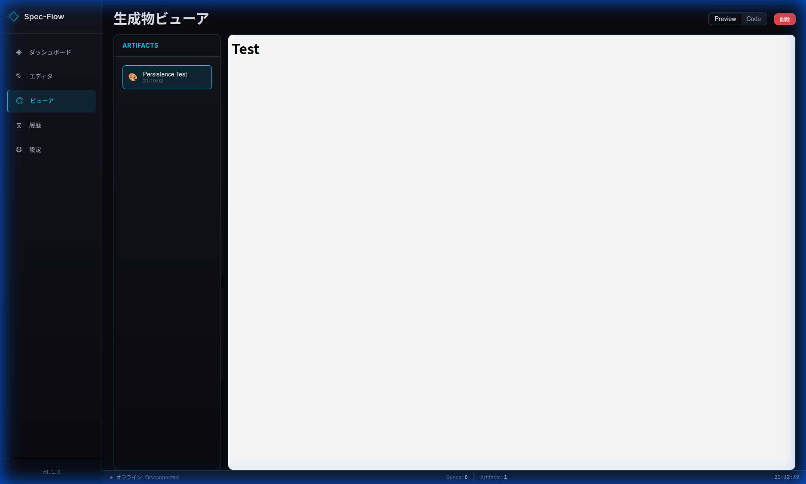

# Spec-Flow Studio

AI Agent Specification Editor with Diff Management — Companion tool for [Aether Console](https://github.com/mjurymaru-blip/aether-console).

> **Target Audience**: AI System Architects & Engineers.
> **For those who**: Need precise control over AI behaviors and want to enforce strict constraints (Governance) rather than just "Prompt Engineering".

## Overview

Spec-Flow Studio is a **YAML-based specification editor** for defining AI agent behaviors. It enables:

- 📝 **Spec-Kit Editor** — Edit agent specifications with syntax highlighting
- 🔍 **Constraint Enforcement** — Visualize constraints and validate compliance with real-time feedback
- ✨ **AI Artifact Generation** — Generate UI mocks, API specs, test cases via Gemini API
- 📊 **Communication Diagrams** — Visualize agent interactions with Mermaid
- 🔄 **Diff Management** — Track specification changes with version history
- 🔌 **WebSocket Integration** — Real-time sync with Aether Console

## Screenshots

### Dashboard


### Editor


### Viewer


## Getting Started

```bash
# Install dependencies
npm install

# Start development server
npm run dev

# Build for production
npm run build
```

デフォルトで `http://localhost:5173` で起動します。

## Tech Stack

> **Note**: This project uses `@vitejs/plugin-basic-ssl` for HTTPS development server to prevent Mixed Content errors with Aether Console. You may see a browser warning about self-signed certificate. Please accept to proceed.
> HTTPS URL: `https://localhost:3001`

| Category | Technology |
|----------|------------|
| Framework | SvelteKit + Svelte 5 (Runes) |
| Editor | CodeMirror 6 |
| Diagrams | Mermaid |
| AI | Google Gemini API |
| Encryption | Web Crypto API (AES-GCM) |
| Real-time | WebSocket (ws) |

---

## 使い方

### 1. エディタでSpec-Kitを作成

1. サイドバーから「エディタ」を選択
2. **テンプレート選択**で基本テンプレートを選び「Load Template」をクリック
3. YAMLを編集してエージェント仕様を定義
4. 右側の「Constraints」パネルで制約条件を確認

### 2. アーティファクトを生成

1. 「Generate Artifacts」をクリック
2. 生成するタイプを選択（UI Mock / API Spec / Test Case / Use Case Diagram）
3. 「生成開始」をクリック

> **Note**: 初回はAPIキー設定が必要です（設定ページ）。

### 3. 生成物を確認

1. 「ビューア」ページを開く
2. 左のリストから生成物を選択
3. **Preview**/**Code** で表示モードを切り替え

---

## Spec-Kit Format

エージェント仕様のYAML形式：

```yaml
kind: Agent
version: v1
metadata:
  name: analyzer
  displayName: "Analyzer"
  description: "情報解析エージェント"

spec:
  role: |
    入力データを分析し、構造化された情報を抽出する。

  capabilities:
    - data-analysis
    - pattern-recognition

  constraints:
    - "推測で情報を補完しない"
    - "確信度が低い場合は明示する"

  communication:
    canSendTo: [predictor, planner]
    canReceiveFrom: [planner, monitor]
```

### 主要フィールド

| Field | Description |
|-------|-------------|
| `metadata.name` | エージェント識別子 |
| `spec.role` | エージェントの役割説明 |
| `spec.capabilities` | 実行可能な機能リスト |
| `spec.constraints` | 行動制約（AIが守るべきルール）|
| `spec.communication` | 他エージェントとの通信許可 |

---

## API Key Configuration

### 開発モード（個人利用）

設定ページでAPIキーを登録します：

1. 「設定」ページを開く
2. **Gemini API Key** を入力
3. **暗号化パスワード** を設定
4. 「APIキーを保存」をクリック

> **Security**: APIキーはブラウザ内で暗号化（AES-GCM）され、localStorageに保存されます。サーバーには送信されません。

### 本番モード（共有デプロイ）

本番環境では、サーバー側でAPIキーを管理できます（プロキシモード）：

```bash
# 環境変数を設定
export GEMINI_API_KEY=your-api-key-here
export NODE_ENV=production
export WS_ALLOWED_ORIGINS=https://your-domain.com

# サーバー起動
npm run build && npm run preview
```

| 環境変数 | 説明 |
|----------|------|
| `GEMINI_API_KEY` | Gemini APIキー（設定するとユーザー入力不要） |
| `NODE_ENV` | `production`で厳格なセキュリティ検証を有効化 |
| `WS_ALLOWED_ORIGINS` | 許可するオリジン（カンマ区切り） |
| `WS_SECRET` | WebSocket認証用シークレット |

> **Note**: `GEMINI_API_KEY`を設定すると、ユーザーはAPIキーを入力せずに生成機能を利用できます。

---

## Integration with Aether Console

Spec-Flow Studio connects to Aether Console via WebSocket:

```
Aether Console (localhost:5173) ⟷ Spec-Flow Studio (localhost:3001)
                                   WebSocket: wss://localhost:3001/api/ws
```

For detailed protocol specification, see [WEBSOCKET_API.md](./WEBSOCKET_API.md).

単体利用も可能です。接続状態が「Disconnected」でも全機能を利用できます。

---

## Project Structure

```
src/
├── lib/
│   ├── components/    # UI Components
│   │   ├── ui/        # Button, Panel, StatusIndicator
│   │   └── editor/    # SpecEditor, ConstraintPanel
│   ├── stores/        # Svelte Stores
│   └── utils/         # Utilities (YAML, Crypto, Storage)
├── routes/
│   ├── editor/        # Spec Editor
│   ├── viewer/        # Artifact Viewer
│   ├── history/       # Version History
│   └── settings/      # Settings
└── api/
    ├── generate/      # AI Generation Endpoint
    └── models/        # Model List Endpoint
```

---

## License

MIT
