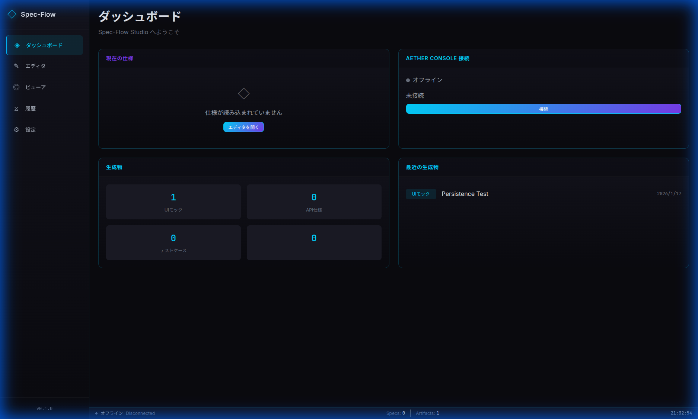
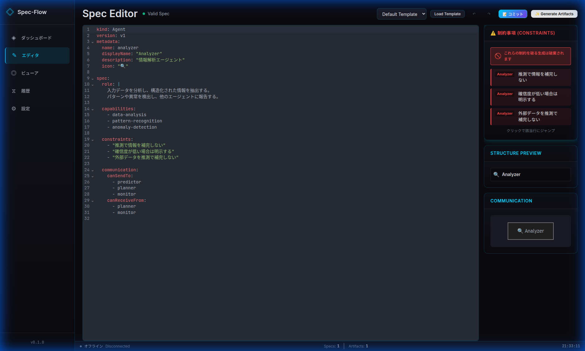

# Spec-Flow Studio ユーザーガイド

Spec-Flow Studioは、AIエージェントの仕様（Spec-Kit）を編集・管理し、AIによる成果物を生成するためのWebアプリケーションです。

## 目次

1. [はじめに](#はじめに)
2. [起動方法](#起動方法)
3. [画面構成](#画面構成)
4. [基本的な使い方](#基本的な使い方)
5. [各機能の詳細](#各機能の詳細)
6. [API設定](#api設定)
7. [トラブルシューティング](#トラブルシューティング)

---

## はじめに

### Spec-Kit形式とは

Spec-Kitは、AIエージェントの振る舞いをYAML形式で定義する仕様書フォーマットです。

```yaml
agents:
  - name: analyzer
    displayName: 分析エージェント
    role: ユーザーの要件を分析し、タスクに分解する
    capabilities:
      - 自然言語の解析
      - タスクの優先度付け
    constraints:
      - ユーザーの明示的な指示なしに外部APIを呼び出さない
    communication:
      canSendTo: [executor]
      canReceiveFrom: [user]
```

---

## 起動方法

### 開発サーバー

```bash
cd spec-flow-studio
npm install
npm run dev
```

デフォルトで `http://localhost:5173` で起動します。

---

## 画面構成

### サイドバーナビゲーション

| アイコン | ページ | 説明 |
|---------|--------|------|
| 🏠 | ダッシュボード | 現在の状態一覧、クイックアクション |
| ✏️ | エディタ | Spec-Kit YAMLの編集 |
| 📄 | ビューア | 生成したアーティファクトの閲覧 |
| 📜 | 履歴 | 変更履歴（パッチ）の管理 |
| ⚙️ | 設定 | API設定、データ管理 |

### ステータスバー

画面下部に表示され、以下の情報を確認できます：
- **接続状態**: Aether Consoleとの接続状況
- **Specs**: 定義済みエージェント数
- **Artifacts**: 生成物の数
- **現在時刻**

---

## 基本的な使い方

### 1. エディタでSpec-Kitを作成・編集

1. サイドバーから「エディタ」を選択
2. **テンプレート選択**で基本テンプレートを選び「Load Template」をクリック
3. YAMLを編集してエージェント仕様を定義
4. 右側の「Structure Preview」でエージェント構造を確認
5. 「Constraints」パネルで制約条件を一覧表示

### 2. アーティファクト（成果物）を生成

1. エディタ画面で「Generate Artifacts」をクリック
2. 生成する成果物のタイプを選択：
   - **UI Mock**: HTMLモックアップ
   - **API Spec**: OpenAPI仕様
   - **Test Case**: テストケース
   - **Use Case Diagram**: ユースケース図
3. 「生成開始」をクリック（初回はパスワード入力が必要）

### 3. 生成物を確認

1. 「ビューア」ページを開く
2. 左のリストから生成物を選択
3. **Preview**/**Code** で表示モードを切り替え
4. 不要な生成物は「削除」で削除

---

## 画面スクリーンショット

### ダッシュボード
現在の状態一覧とクイックアクション：



### エディタ
Spec-Kit YAMLの編集画面。右側に制約パネルと通信図：



### ビューア
生成したアーティファクトの閲覧。Preview/Code切り替え可能：


---

## 各機能の詳細

### エディタ機能

#### テンプレート

| テンプレート | 用途 |
|-------------|------|
| Default Template | 汎用的なエージェント定義 |
| Analyzer Agent | 分析系エージェントのテンプレート |

#### バリデーション

YAMLの構文エラーはリアルタイムで検出され、ヘッダーに表示されます。

#### 制約クリック→行ジャンプ

右側の「Constraints」パネルで制約をクリックすると、エディタ内の該当行にジャンプしてハイライト表示されます。

### Communication Diagram

エディタ右下の「Communication」タブで、エージェント間の通信関係をMermaid図として可視化できます。

### 履歴（パッチ）管理

「コミット」ボタンで変更をパッチとして保存できます。履歴ページで過去の変更を確認できます。

---

## API設定

### Gemini API キーの設定

1. 「設定」ページを開く
2. **Gemini API Key** 欄にAPIキーを入力
3. **暗号化パスワード** を設定（このパスワードでAPIキーが暗号化されます）
4. 「APIキーを保存」をクリック

> **セキュリティ**: APIキーはブラウザのLocalStorageに暗号化（AES-GCM）された状態で保存されます。サーバーには送信されません。

### モデル選択

APIキー保存後、「モデル一覧を更新」でGeminiの利用可能モデルを取得できます。

---

## トラブルシューティング

### 「生成開始」が反応しない

- **パスワード未入力**: セッションごとに暗号化パスワードの入力が必要です
- **APIキー未設定**: 設定ページでAPIキーを保存してください

### ビューアに生成物が表示されない

- エディタページで生成後、ビューアに移動して確認してください
- 生成物はlocalStorageに自動保存されます

### 接続状態が「Disconnected」

- Aether Consoleとの連携には別途Aether Consoleの起動が必要です
- 単体利用の場合は「Disconnected」のままで問題ありません

---

## ショートカット

| 操作 | 説明 |
|------|------|
| エディタ内 Ctrl+Z | 元に戻す |
| エディタ内 Ctrl+Shift+Z | やり直す |
| ↶ / ↷ ボタン | Undo/Redo（Spec単位） |

---

## 技術スタック

- **フレームワーク**: SvelteKit + Svelte 5 (Runes)
- **エディタ**: CodeMirror 6
- **図表**: Mermaid
- **AI**: Google Gemini API
- **暗号化**: Web Crypto API (AES-GCM)
